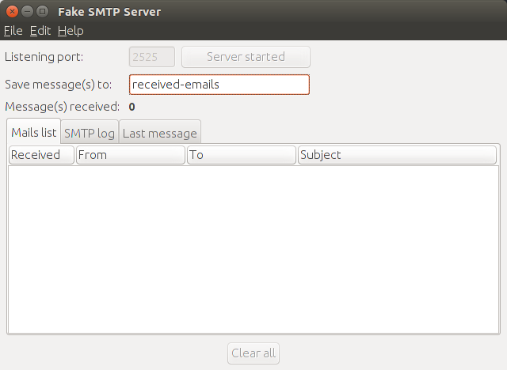
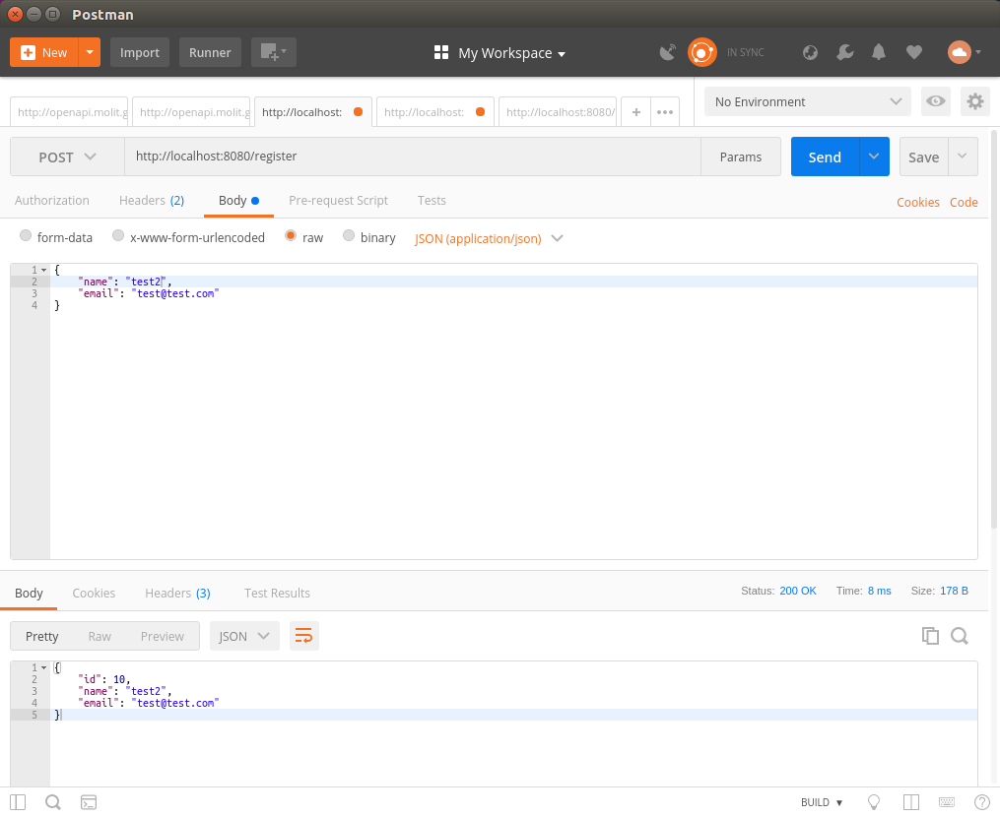
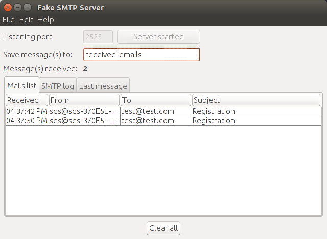

### Usage ###

* download FakeSMTP : http://nilhcem.com/FakeSMTP/download.html

* launch fakeSMTP
``` bash
java -jar fakeSMTP-2.0.jar
```
* set port 2525 and start the SMTP server


* send a POST request after launching application


* check the receieved email
